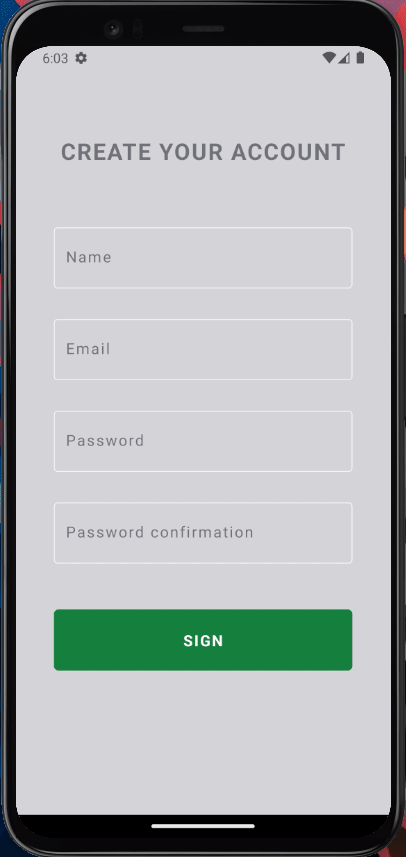

# React-Native-Animated-Form

<h2 align="center">
  A simple animated form built with declarative ui and validation. Built with React Native, Expo, Native Base, React Hook Form and Reanimated.
</h2>

<p align="center">
  
  
  
  
  <a href="https://github.com/areasflavio/react-native-animated-form/commits/master">
    
  </a>
</p>

<p align="center">
  <a href="#star-features">Features</a>&nbsp;&nbsp;|&nbsp;&nbsp;
  <a href="#keyboard-technologies">Technologies</a>&nbsp;&nbsp;|&nbsp;&nbsp;
  <a href="#computer_mouse-installation">Installation</a>
</p>

<p align="center">
  
</p>

<br/>

# :star: Features

[(Back to top)](#React-Native-Animated-Form)

Some key features are:

- Ui built with declarative components
- Form control and validation with React Hook Form and Yup
- Smooth animations for the labels and the button

The application is built using React Native with Expo framework.
The Ui os built with Native Base lib and Reanimated.
The entire codebase is written using Typescript.

<br/>

# :keyboard: Technologies

[(Back to top)](#React-Native-Animated-Form)

This is what I used and learned with this project:

- [x] React Native
- [x] Expo
- [x] Native Base
- [x] React Hook Form
- [x] Reanimated
- [x] Typescript

<br/>

# :computer_mouse: Installation

[(Back to top)](#React-Native-Animated-Form)

To use this project, first you need NodeJS installed in your device,
then you can follow the commands below:

```bash
# Clone this repository
git clone https://github.com/areasflavio/react-native-animated-form.git

# Go into the repository
cd react-native-animated-form

# Install dependencies for the application
yarn install

# To start the development server, run the following command
yarn start

# You start the emulator following the terminal instructions or:
yarn start android # for android emulator

yarn start ios # for ios emulator
```

# :man_technologist: Author

[(Back to top)](#React-Native-Animated-Form)

Build by Flávio Arêas 👋 [Get in touch!](https://www.linkedin.com/in/areasflavio/)
